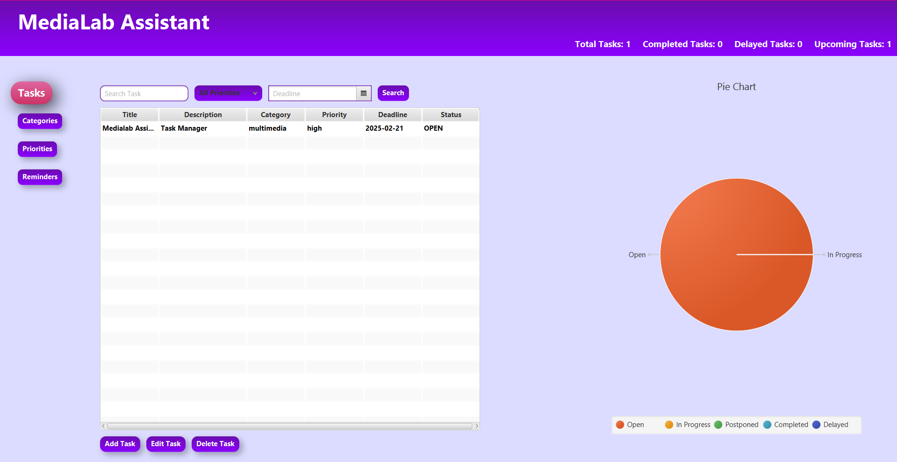

# MediaLab Assistant
## Task Manager

## 📝 Project Overview
MediaLab Assistant is a smart and intuitive **task management system**, designed as a final project for the Multimedia course at NTUA. It empowers users to effortlessly create, update, and organize their tasks while managing categories, priorities, and reminders—all through a sleek JavaFX interface. With intelligent task organization and seamless management, staying productive has never been easier! 

## 🚀 Why Use MediaLab Assistant?
✔ **Tired of messy to-do lists?** Keep your tasks structured and organized.  
✔ **Never miss a deadline again!** Smart reminders help you stay on track.  
✔ **Track your productivity.** View completed vs. pending tasks in a visual format.  
✔ **Simple yet powerful.** A clean UI with essential features!

## 🎯 Who Should Use This?
👩‍🎓 **Students** – Keep track of assignments & deadlines.  
💼 **Professionals** – Manage work tasks & projects.  
📝 **Freelancers** – Organize clients & deliverables.  
 **Anyone who needs structure!**  

---

## Screenshot GUI
### Main Application Window


---

## 💻 Technologies Used
- **Programming Language:** Java  
- **GUI Framework:** JavaFX 
- **UI Deisgn:** Scene Builder
- **IDE:** IntelliJ IDEA  
- **Data Storage:** JSON files (stored in the "medialab" folder)

---
## 🔧 Requirements
- **Java JDK 23**.
- **JavaFX SDK**.
- **Intellij IDEA (Recommended)**
- **Scene Builder (for UI design, optional)**
---


## ⚙️ How to Run
### 1. Clone the Repository:
```bash
git clone https://github.com/alexandramoraitaki/Task-Manager.git
Then, navigate to the project folder:
cd Task-Manager
```
Make sure you have Java 23 and JavaFX SDK 23+ installed locally.

### 2. Open in Intellij IDEA (or your IDE):
Open the folder

Since this project uses JavaFX without a build tool (like Maven or Gradle), you need to manually provide the JavaFX libraries:

Go to Run > Edit Configurations…

Add a new Application configuration:
- Main class: Main (or use the file picker to locate it)
- VM options:
--module-path "C:\path\to\javafx-sdk-23.0.1\lib" --add-modules javafx.controls,javafx.fxml
Replace the path with the actual location where you installed the JavaFX SDK.
Apply the configuration and save.

### 3. Run the Application:
- Locate the Main.java file inside src/.
- Click the Run button in IntelliJ.
- 
💡 Need Help?
📦 Download JavaFX SDK: https://gluonhq.com/products/javafx/

---

## 📝 Features
- **Task Management:** Create, update, delete, and search tasks with details like:
  - Title  
  - Description  
  - Category  
  - Priority  
  - Deadline  
  - Status *(Open, In Progress, Postponed, Completed, Delayed)*  
- **Category & Priority Management:** Add, edit, and delete categories and priority levels.  
- **Reminders:** Set task reminders *(1 day, 1 week, 1 month before deadline, or a custom date)*.
- **Pie Chart Statistics:** 📊 A dynamic **PieChart** displays the percentage of tasks in each status *(Open, In Progress, Completed, etc.)*, helping users visualize progress at a glance.  
- **Persistent Storage:** Task data is stored in **JSON format**, ensuring data retention across sessions.  

---

## 👩‍💻 About the Contributor  
Hi! I'm **Alexandra Moraitaki**, a passionate computer engineering student at NTUA.  

📫 **Want to connect?**  
- LinkedIn: [LinkedIn: alexandra-moraitaki](https://www.linkedin.com/in/alexandra-moraitaki/)
- Email: moraitaki.alexandra@gmail.com 

## 🙌 Thank You!  
Thank you for checking out **MediaLab Assistant**! I hope you find it useful.  
If you have any feedback, suggestions, or just want to connect, feel free to reach out!  

---


